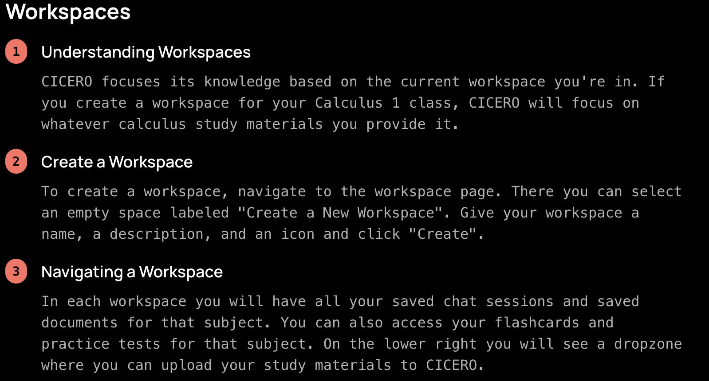

# **Cicero**
## *The AI Tutor Redifining Education and Revolutionizing the Way You Learn*

## A Brief Overview

Cicero is an advanced AI-driven learning tool designed to foster personalized and interactive educational experiences. It offers key features like interactive chat generation, content analysis, and automated flashcard creation, utilizing cutting-edge AI technologies, including OpenAI's GPT series and Meta’s open-source LLaMA 3.1. These AI models function as separate but interconnected agents, enhancing the tool's ability to provide detailed explanations, summaries, and personalized learning paths.

Users can easily create dedicated workspaces to focus on specific subjects or topics. In these workspaces, they can upload documents (such as PDFs), which become the focal point of their sessions. JavaScript-based tools handle the parsing of the uploaded files, while LLaMA annotates and intelligently analyzes the content.
The text and LlaMa's analysis is stored in Pinecone's vector database which in turn fuels the Retrieval-Augmented Generation (RAG) models powered by OpenAI.
These models provide features like custom flashcard generation and context aware chat generation.

User's have access to a robust front end platform powered by React and Next.js.
Their activities and information are stored in Firebase to ensure data consistency and persistance across different sessions and devices.

Cicero empowers learners by combining the strengths of multiple AI models, creating a truly adaptive and contextually aware learning environment.

## Ingenium STEM Hackathon

This Project was developed for the [Ingenium STEM Hackathon of 2024 ](https://ingenium-stem-2.devpost.com/?ref_feature=challenge&ref_medium=your-open-hackathons&ref_content=Submissions+open).
Ingenium Summer Hacks 2.0 challenged participants to create innovative and impactful projects leveraging AI to address various aspects of social good. 
Personalized tutoring can lead to better learning outcomes, however many cannot afford its costs. 
We believe that using artificial intelligence to make education more accessible and personalized can empower learners of all backgrounds, enabling them to reach their full potential. Our AI tutor aims to bridge the gap between learners and educational resources, providing tailored guidance and interactive learning experiences.

## About The Developers:

**Mohammad Najm** is a software engineer with a passion for leveraging technology to create innovative solutions. With interests in artificial intelligence and software development, Mohammad has worked on various projects aimed at improving accessibility and enhancing user experiences. He continues to explore new technologies and expand his skills, focusing on building impactful tools that address real-world challenges. View
[Mohammad's LinkedIn](www.linkedin.com/in/Mohammad-Najm) and his 
[Github](https://github.com/Mnajm6201)

**Fei Lin** is a software engineer specializing in full stack development with a focus on integrating artificial intelligence into dynamic, scalable systems. With experience in both front-end and back-end technologies, Fei is dedicated to building seamless, intelligent solutions that address real-world challenges. Currently, Fei is expanding his skills and aiming to secure a software engineering internship for the upcoming summer to further develop his expertise and contribute to innovative projects. View his [LinkedIn](https://www.linkedin.com/in/fei-lincs/) and his [Github](https://github.com/walletkun)


**Adam Sadov** is a software engineer with a strong foundation in data science, blending programming expertise with analytical skills to develop data-driven solutions. With experience in software development and data analysis, Adam is passionate about using technology to derive insights and build scalable applications. Continuously expanding his knowledge in both fields, Adam is focused on creating impactful software that leverages data to solve complex problems. View [Adam's LinkedIn](https://www.linkedin.com/in/adam-sadov-b23b61204/) and his    [Github](https://github.com/dabrownies)

## Technologies Used
- **JavaScript**: For building the front end and back end of the application.
- **Python**: Used for utility scripts and API handling.
- **Node.js**: Backend framework to handle server-side logic.
- **React**: For the interactive user interface.
- **Next.js**: Used for the front end of the platform.
- **Firebase**: For authentication and database storage.
- **Pinecone**: Used for vector storage and retrieval.
- **OpenAI GPT**: Provides the AI capabilities for chat and flashcard generation.
- **LLaMa 3.1**: Provides data analysis, contextualization, and thoughtful breakdown of documents.
- **Tailwind**: Used for dynamic styling in front end interface.
- **Shadcn/ui**: Provided UI components for user interaction.
- **Framer-Motion**: Used to create UI implementation.


## Directory Structure
### /app
Defines all of Ciceros backend logic.
### /components
Contains hooks, web pages, ui components and authentication logic.
### /uploads
Directory contains all documents to be uploaded by user.


## 📦 Installation and 🛠 Set Up
*Install Repo*
```bash
git clone https://github.com/walletkun/ingeniumSTEM_Hacks
```

*Set Up Python Environment Using Conda*
```bash 
conda create -n <env name> python = 3.10
conda activate <env name> 
pip install "requirements.txt"
```

*Set up npm env*
```bash
npm install
npm run build
```

*How to Get API Keys*

To run the Cicero project, you'll need API keys for **Firebase**, **Pinecone**, and **OpenAI**. Follow the steps below to obtain these keys.

### 1. Firebase API Key

1. Go to [Firebase Console](https://console.firebase.google.com/).
2. Click on **Add Project** or select your existing project.
3. Once the project is created, go to **Project Settings** by clicking the gear icon.
4. Scroll down to the **Your apps** section and click on **Add app** to add a web app.
5. After adding the app, Firebase will generate the required credentials:
   - `NEXT_PUBLIC_FIREBASE_API_KEY`
   - `NEXT_PUBLIC_FIREBASE_AUTH_DOMAIN`
   - `NEXT_PUBLIC_FIREBASE_PROJECT_ID`
   - `NEXT_PUBLIC_FIREBASE_STORAGE_BUCKET`
   - `NEXT_PUBLIC_FIREBASE_MESSAGING_SENDER_ID`
   - `NEXT_PUBLIC_FIREBASE_APP_ID`
   - `NEXT_PUBLIC_FIREBASE_MEASUREMENT_ID`
6. Insert these values into your `.env` file.

### 2. Pinecone API Key

1. Visit the [Pinecone](https://www.pinecone.io/) website and sign up for an account.
2. After logging in, go to the **API Keys** section in your Pinecone dashboard.
3. Click **Create an API Key** to generate your API key.
4. Copy the generated API key and place it in the `.env` file like this:
   - `PINECONE_APIKEY="Your Pinecone API key"`

### 3. OpenAI API Key

1. Go to the [OpenAI Platform](https://platform.openai.com/signup/) and create an account.
2. After logging in, navigate to the [API Keys section](https://platform.openai.com/account/api-keys).
3. Click **Create new secret key** to generate your API key.
4. Copy this key and place it in your `.env` file like this:
   - `OPENAI_APIKEY="Your OpenAI API key"`

*Set up .env*
```bash
touch .env
nano .env
```
## 4. Groq Llama Key
1. Go to the [Groq platform](https://groq.com/).
2. Click on 'Developers' the 'start building'
3. API Keys then create API keys 
4. Enter a display name and copy the given key.
Then insert keys into the relevant fields of the .env using the format below:

NEXT_PUBLIC_FIREBASE_API_KEY="Your Firebase API key"
NEXT_PUBLIC_FIREBASE_AUTH_DOMAIN="Your Firebase Auth Domain"
NEXT_PUBLIC_FIREBASE_PROJECT_ID="Your Firebase Project ID"
NEXT_PUBLIC_FIREBASE_STORAGE_BUCKET="Your Firebase Storage Bucket"
NEXT_PUBLIC_FIREBASE_MESSAGING_SENDER_ID="Your Firebase Messaging Sender ID"
NEXT_PUBLIC_FIREBASE_APP_ID="Your Firebase App ID"
NEXT_PUBLIC_FIREBASE_MEASUREMENT_ID="Your Firebase Measurement ID"
FIREBASE_PROJECT_ID="Your Firebase Project ID"
FIREBASE_CLIENT_EMAIL="Your Firebase Client Email"
FIREBASE_PRIVATE_KEY="Your Firebase Private Key"
FIREBASE_DATABASE_URL="Your Firebase Database URL"
PINECONE_APIKEY="Your Pinecone API key"
OPENAI_APIKEY="Your OpenAI API key"
GROQ_API_KEY="Your GROQ API key"

**WARNING: You may have to insert OpenAI keys directly in code in app/openaiTutor.js, and OpenAI keys and Pinecone key in app/pinecone_operations/pinecone_upload and app/pinecone_operations/pinecone_retrieve. Unfortunately we would not able to find a consistent solution to this issue.

*Creating and Filling Firebase Admin SDK JSON File*
```bash 
mdkir admin_key
touch admin_key/ai-tutor-3dc92-firebase-adminsdk-oesm6-ab20dc17ad.json
```

Paste the following JSON structure into ai-tutor-3dc92-firebase-adminsdk-oesm6-ab20dc17ad.json, 
replacing the placeholder values with the actual values from your .env file:

{
  "type": "service_account",
  "project_id": "YOUR_FIREBASE_PROJECT_ID",
  "private_key_id": "YOUR_PRIVATE_KEY_ID",
  "private_key": "YOUR_PRIVATE_KEY",
  "client_email": "YOUR_CLIENT_EMAIL",
  "client_id": "YOUR_CLIENT_ID",
  "auth_uri": "https://accounts.google.com/o/oauth2/auth",
  "token_uri": "https://oauth2.googleapis.com/token",
  "auth_provider_x509_cert_url": "https://www.googleapis.com/oauth2/v1/certs",
  "client_x509_cert_url": "https://www.googleapis.com/robot/v1/metadata/x509/YOUR_CLIENT_EMAIL"
}

## How to Run Server 🚀
```bash
npm start
```
Use browser of choice to open
(localhost:3000)

## Navigating and Using the Web Interface

   1. Click on 'Sign up' and follow the steps to create an account.
   2. Sign in using your accoung details.
   3. Create a Workspace

   

   4. Upload documents and interact with Cicero!

   ![Document Upload Screenshot] (./public/images/DocumentsScreenshot.png)

   5. Generate Flashcards to test your knowledge

   ![Flashcard Screenshot] (./public/images/FlashcardScreenshot.png)

## Future Plans:
We would like to continously improve this project across the board by 
imlementing new features like: Practice exams, session notes, and study guides.
Expand document analysis to include images and videos.
Improve front end interface
And imrpove user interaction.
This is our 'alpha version', we hope to improve it with our 'beta' and hopefully host the software for real world use.

## Open Source License


Copyright <2024> <Mohammad Najm, Fei Lin, Adam Sadov>

Permission is hereby granted, free of charge, to any person obtaining a copy of this software and associated documentation files (the “Software”), to deal in the Software without restriction, including without limitation the rights to use, copy, modify, merge, publish, distribute, sublicense, and/or sell copies of the Software, and to permit persons to whom the Software is furnished to do so, subject to the following conditions:

The above copyright notice and this permission notice shall be included in all copies or substantial portions of the Software.

THE SOFTWARE IS PROVIDED “AS IS”, WITHOUT WARRANTY OF ANY KIND, EXPRESS OR IMPLIED, INCLUDING BUT NOT LIMITED TO THE WARRANTIES OF MERCHANTABILITY, FITNESS FOR A PARTICULAR PURPOSE AND NONINFRINGEMENT. IN NO EVENT SHALL THE AUTHORS OR COPYRIGHT HOLDERS BE LIABLE FOR ANY CLAIM, DAMAGES OR OTHER LIABILITY, WHETHER IN AN ACTION OF CONTRACT, TORT OR OTHERWISE, ARISING FROM, OUT OF OR IN CONNECTION WITH THE SOFTWARE OR THE USE OR OTHER DEALINGS IN THE SOFTWARE.


